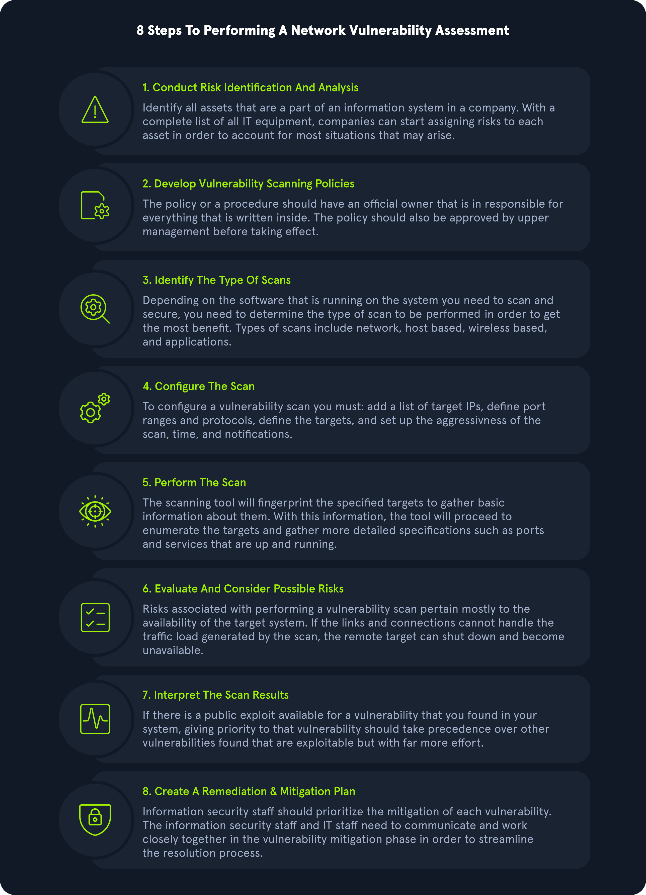

Every organization must perform different types of `Security assessments` on their `networks`, `computers`, and `applications` at least every so often. The primary purpose of most types of security assessments is to find and confirm vulnerabilities are present, so we can work to `patch`, `mitigate`, or `remove` them. There are different ways and methodologies to test how secure a computer system is. Some types of security assessments are more appropriate for certain networks than others. But they all serve a purpose in improving cybersecurity. All organizations have different compliance requirements and risk tolerance, face different threats, and have different business models that determine the types of systems they run externally and internally. Some organizations have a much more mature security posture than their peers and can focus on advanced red team simulations conducted by third parties, while others are still working to establish baseline security. Regardless, all organizations must stay on top of both legacy and recent vulnerabilities and have a system for detecting and mitigating risks to their systems and data.
## Penetration Test

They're called penetration tests because testers conduct them to determine if and how they can penetrate a network. A pentest is a type of simulated cyber attack, and pentesters conduct actions that a threat actor may perform to see if certain kinds of exploits are possible. The key difference between a pentest and an actual cyber attack is that the former is done with the full legal consent of the entity being pentested. Whether a pentester is an employee or a third-party contractor, they will need to sign a lengthy legal document with the target company that describes what they're allowed to do and what they're not allowed to do.

- `Black box` pentesting is done with no knowledge of a network's configuration or applications.
- `Grey box` pentesting is done with a little bit of knowledge of the network they're testing, from a perspective equivalent to an `employee` who doesn't work in the IT department, such as a `receptionist` or `customer service agent`.
- `White box` pentesting is typically conducted by giving the penetration tester full access to all systems, configurations, build documents, etc., and source code if web applications are in-scope. The goal here is to discover as many flaws as possible that would be difficult or impossible to discover blindly in a reasonable amount of time.
- `Application` pentesters assess web applications, thick-client applications, APIs, and mobile applications.
- `Network` or `infrastructure` pentesters assess all aspects of a computer network, including its `networking devices` such as routers and firewalls, workstations, servers, and applications. These types of penetration testers typically must have a strong understanding of networking, Windows, Linux, Active Directory, and at least one scripting language. Network vulnerability scanners, such as `Nessus`, can be used alongside other tools during network pentesting, but network vulnerability scanning is only a part of a proper pentest.

 Also, vulnerability scanning would only be a small part of this type of penetration test. Vulnerability scanners are helpful but limited and cannot replace the human touch and other tools and techniques.

`Physical` pentesters try to leverage physical security weaknesses and breakdowns in processes to gain access to a facility such as a data center or office building.

- Can you open a door in an unintended way?
- Can you tailgate someone into the data center?
- Can you crawl through a vent?

`Social engineering` pentesters test human beings.

- Can employees be fooled by phishing, vishing (phishing over the phone), or other scams?
- Can a social engineering pentester walk up to a receptionist and say, "yes, I work here?"
## Vulnerability Assessments vs. Penetration Tests

`Vulnerability Assessments` and Penetration Tests are two completely different assessments. Vulnerability assessments look for vulnerabilities in networks without simulating cyber attacks. All companies should perform vulnerability assessments every so often. A wide variety of security standards could be used for a vulnerability assessment, such as GDPR compliance or OWASP web application security standards. A vulnerability assessment goes through a checklist.

- Do we meet this standard?
- Do we have this configuration?
# Vulnerability Assessment
## Methodology

Below is a sample vulnerability assessment methodology that most organizations could follow and find success with. Methodologies may vary slightly from organization to organization, but this chart covers the main steps, from identifying assets to creating a remediation plan.

## Understanding Key Terms

Before we go any further, let's identify some key terms that any IT or Infosec professional should understand and be able to explain clearly.

#### Vulnerability

A `Vulnerability` is a weakness or bug in an organization's environment, including applications, networks, and infrastructure, that opens up the possibility of threats from external actors. Vulnerabilities can be registered through MITRE's [Common Vulnerability Exposure database](https://cve.mitre.org/) and receive a [Common Vulnerability Scoring System (CVSS)](https://nvd.nist.gov/vuln-metrics/cvss/v3-calculator) score to determine severity.
#### Threat

A `Threat` is a process that amplifies the potential of an adverse event, such as a threat actor exploiting a vulnerability.
#### Exploit

An `Exploit` is any code or resources that can be used to take advantage of an asset's weakness.
#### Risk

`Risk` is the possibility of assets or data being harmed or destroyed by threat actors.

To differentiate the three, we can think of it as follows:

- `Risk`: something bad that could happen
- `Threat`: something bad that is happening
- `Vulnerabilities`: weaknesses that could lead to a threat
## Asset Management

When an organization of any kind, in any industry, and of any size needs to plan their cybersecurity strategy, they should start by creating an inventory of their `data assets`. If you want to protect something, you must first know what you are protecting! Once assets have been inventoried, then you can start the process of `asset management`. This is a key concept in defensive security.

#### Asset Inventory

`Asset inventory` is a critical component of vulnerability management. An organization needs to understand what assets are in its network to provide the proper protection and set up appropriate defenses. The asset inventory should include information technology, operational technology, physical, software, mobile, and development assets. Organizations can utilize asset management tools to keep track of assets. The assets should have data classifications to ensure adequate security and access controls.
#### Application and System Inventory

An organization should create a thorough and complete inventory of data assets for proper asset management for defensive security. Data assets include:

- All data stored on-premises. HDDs and SSDs in endpoints (PCs and mobile devices), HDDs & SSDs in servers, external drives in the local network, optical media (DVDs, Blu-ray discs, CDs), flash media (USB sticks, SD cards). Legacy technology may include floppy disks, ZIP drives (a relic from the 1990s), and tape drives.
- All of the data storage that their cloud provider possesses. [Amazon Web Services](https://aws.amazon.com/) (`AWS`), [Google Cloud Platform](https://cloud.google.com/) (`GCP`), and [Microsoft Azure](https://azure.microsoft.com/en-us/) are some of the most popular cloud providers, but there are many more. Sometimes corporate networks are "multi-cloud," meaning they have more than one cloud provider. A company's cloud provider will provide tools that can be used to inventory all of the data stored by that particular cloud provider.
- All data stored within various `Software-as-a-Service (SaaS)` applications. This data is also "in the cloud" but might not all be within the scope of a corporate cloud provider account. These are often consumer services or the "business" version of those services. Think of online services such as `Google Drive`, `Dropbox`, `Microsoft Teams`, `Apple iCloud`, `Adobe Creative Suite`, `Microsoft Office 365`, `Google Docs`, and the list goes on.
- All of the applications a company needs to use to conduct their usual operation and business. Including applications that are deployed locally and applications that are deployed through the cloud or are otherwise Software-as-a-Service.
- All of a company's on-premises computer networking devices. These include but aren't limited to `routers`, `firewalls`, `hubs`, `switches`, dedicated `intrusion detection` and `prevention systems` (`IDS/IPS`), `data loss prevention` (`DLP`) systems, and so on.

# Assessment Standards
## Compliance Standards

Each regulatory compliance body has its own information security standards that organizations must adhere to maintain their accreditation. The big compliance players in information security are `PCI`, `HIPAA`, `FISMA`, and `ISO 27001`.
#### Payment Card Industry Data Security Standard (PCI DSS)

The [Payment Card Industry Data Security Standard (PCI DSS)](https://www.pcisecuritystandards.org/pci_security/) is a commonly known standard in information security that implements requirements for organizations that handle credit cards. While not a government regulation, organizations that store, process, or transmit cardholder data must still implement PCI DSS guidelines. This would include banks or online stores that handle their own payment solutions (e.g., Amazon).
#### Health Insurance Portability and Accountability Act (HIPAA)

`HIPAA` is the [Health Insurance Portability and Accountability Act](https://www.hhs.gov/programs/hipaa/index.html), which is used to protect patients' data. HIPAA does not necessarily require vulnerability scans or assessments; however, a risk assessment and vulnerability identification are required to maintain HIPAA accreditation.
### Federal Information Security Management Act (FISMA)

The [Federal Information Security Management Act (FISMA)](https://www.cisa.gov/federal-information-security-modernization-act) is a set of standards and guidelines used to safeguard government operations and information. The act requires an organization to provide documentation and proof of a vulnerability management program to maintain information technology systems' proper availability, confidentiality, and integrity.
#### ISO 27001

`ISO 27001` is a standard used worldwide to manage information security. [ISO 27001](https://www.iso.org/isoiec-27001-information-security.html) requires organizations to perform quarterly external and internal scans.
## Penetration Testing Standards

Penetration tests should not be performed without any `rules` or `guidelines`. There must always be a specifically defined scope for a pentest, and the owner of a network must have a `signed legal contract` with pentesters outlining what they're allowed to do and what they're not allowed to do.
#### PTES

The [Penetration Testing Execution Standard](http://www.pentest-standard.org/index.php/Main_Page) (`PTES`) can be applied to all types of penetration tests. It outlines the phases of a penetration test and how they should be conducted. These are the sections in the PTES:

- Pre-engagement Interactions
- Intelligence Gathering
- Threat Modeling
- Vulnerability Analysis
- Exploitation
- Post Exploitation
- Reporting
#### OSSTMM

`OSSTMM` is the `Open Source Security Testing Methodology Manual`, another set of guidelines pentesters can use to ensure they're doing their jobs properly. It can be used alongside other pentest standards.

[OSSTMM](https://www.isecom.org/OSSTMM.3.pdf) is divided into five different channels for five different areas of pentesting:

1. Human Security (human beings are subject to social engineering exploits)
2. Physical Security
3. Wireless Communications (including but not limited to technologies like WiFi and Bluetooth)
4. Telecommunications
5. Data Networks
#### NIST

The `NIST` (`National Institute of Standards and Technology`) is well known for their [NIST Cybersecurity Framework](https://www.nist.gov/cyberframework), a system for designing incident response policies and procedures. NIST also has a Penetration Testing Framework. The phases of the NIST framework include:

- Planning
- Discovery
- Attack
- Reporting
#### OWASP

`OWASP` stands for the [Open Web Application Security Project](https://owasp.org/). They're typically the go-to organization for defining testing standards and classifying risks to web applications.

OWASP maintains a few different standards and helpful guides for assessing various technologies:

- [Web Security Testing Guide (WSTG)](https://owasp.org/www-project-web-security-testing-guide/)
- [Mobile Security Testing Guide (MSTG)](https://owasp.org/www-project-mobile-security-testing-guide/)
- [Firmware Security Testing Methodology](https://github.com/scriptingxss/owasp-fstm)
# Common Vulnerability Scoring System (CVSS)

There are various ways to score or calculate severity ratings of vulnerabilities. The [Common Vulnerability Scoring System (CVSS)](https://www.first.org/cvss/) is an industry standard for performing these calculations. Many scanning tools will apply these scores to each finding as a part of the scan results, but it's important that we understand how these scores are derived in case we ever need to calculate one by hand or justify the score applied to a given vulnerability. The CVSS is often used together with the so-called [Microsoft DREAD](https://en.wikipedia.org/wiki/DREAD_\(risk_assessment_model\)). `DREAD` is a risk assessment system developed by Microsoft to help IT security professionals evaluate the severity of security threats and vulnerabilities.
With this, we calculate the risk of a threat or vulnerability based on five main factors:

- Damage Potential
- Reproducibility
- Exploitability
- Affected Users
- Discoverability
## Severity Scoring

The CVSS system helps categorize the severity associated with an issue and allows organizations to prioritize issues based on the rating. The CVSS scoring consists of the `exploitability and impact` of an issue. The `exploitability` measurements consist of `access vector`, `access complexity`, and `authentication`. The `impact` metrics consist of the `CIA triad`, including `confidentiality`, `integrity`, and `availability`.
## Base Metric Group

The CVSS base metric group represents the vulnerability characteristics and consists of `exploitability` metrics and `impact` metrics.

#### Exploitability Metrics

The Exploitability metrics are a way to evaluate the technical means needed to exploit the issue using the metrics below:

- Attack Vector
- Attack Complexity
- Privileges Required
- User Interaction
## Calculating CVSS Severity

The calculation of a CVSS v3.1 score takes into account all the metrics discussed in this section. The National Vulnerability Database has a calculator available to the public [here](https://nvd.nist.gov/vuln-metrics/cvss/v3-calculator).
#### OVAL Definitions

The OVAL definitions are recorded in an XML format to discover any software vulnerabilities, misconfigurations, programs, and additional system information taking out the need to exploit a system. By having the ability to identify issues without directly exploiting the issue, an organization can correlate which systems need to be patched in a network.
The four main classes of OVAL definitions consist of:

- `OVAL Vulnerability Definitions`: Identifies system vulnerabilities
- `OVAL Compliance Definitions`: Identifies if current system configurations meet system policy requirements
- `OVAL Inventory Definitions`: Evaluates a system to see if a specific software is present
- `OVAL Patch Definitions`: Identifies if a system has the appropriate patch
## Common Vulnerabilities and Exposures (CVE)

[Common Vulnerabilities and Exposures (CVE)](https://cve.mitre.org/) is a publicly available catalog of security issues sponsored by the United States Department of Homeland Security (DHS). Each security issue has a unique CVE ID number assigned by the CVE Numbering Authority (CNA).
## Stages of Obtaining a CVE

#### Stage 1: Identify if CVE is Required and Relevant

Identify if the issue found is a vulnerability. According to the CVE Team, "A vulnerability in the context of the CVE Program is indicated by code that can be exploited, resulting in a negative impact to confidentiality, integrity, OR availability, and that requires a coding change, specification change, or specification deprecation to mitigate or address." Additionally, research should verify there is not a CVE ID already in the CVE database.

#### Stage 2: Reach Out to Affected Product Vendor

A researcher should ensure they have made a good faith effort to contact a vendor directly. Researchers can reference CVE's [Documents on Disclosure Practices](https://cve.mitre.org/cve/researcher_reservation_guidelines#appendix#a) for additional information.

#### Stage 3: Identify if Request Should Be For Vendor CNA or Third Party CNA

If a company is a part of participating CNA's, they can assign a CVE ID for one of their products. If the issue is for a participating CNA, researchers can contact the appropriate CNA organization [here](https://cve.mitre.org/cve/request_id.html). If the vendor is not a participating CNA, a researcher should attempt to reach out to the vendor's third-party coordinator.

#### Stage 4: Requesting CVE ID Through CVE Web Form

The CVE Team has a form that can be filled out online [here](https://cveform.mitre.org/) if the methods above do not work for CVE requests.

#### Stage 5: Confirmation of CVE Form

Upon submitting the CVE Web Form mentioned in Stage 4, an individual will receive a confirmation email. The CVE team will contact the requestor if any additional information is required.

#### Stage 6: Receival of CVE ID

Upon approval, the CVE Team will notify the requestor of a CVE ID if the affected product's vulnerability is confirmed. Please note that the CVE ID is not public yet at this stage.

#### Stage 7: Public Disclosure of CVE ID

CVE IDs can be announced to the public as soon as appropriate vendors and parties are aware of the issue to prevent duplication of CVE IDs. This stage ensures that all associated parties are aware of the problem before being publicly disclosed.

#### Stage 8: Announcing the CVE

The CVE Team asks researchers who are sharing multiple CVEs to ensure each CVE indicates the different vulnerabilities. Additional information can be found [here](https://cve.mitre.org/cve/researcher_reservation_guidelines).

#### Stage 9: Providing Information to The CVE Team

At this stage, the CVE Team asks that the researcher help provide additional information to be used in the official CVE listing on the website. The [U.S. National Vulnerability Database (NVD)](https://nvd.nist.gov/) maintains this information online in their database as well.
# Vulnerability Scanning Overview

`Nessus`, `Qualys`, and `Nexpose` are well-known vulnerability scanning platforms. While Nessus and Qualys offer free community editions, Nexpose provides a 30-day trial edition, allowing users to explore its features before committing to a purchase. Additionally, there are open-source alternatives such as OpenVAS.
## Nessus Overview

[Nessus Essentials](https://community.tenable.com/s/article/Nessus-Essentials) by Tenable is the free version of the official Nessus Vulnerability Scanner. Individuals can access Nessus Essentials to get started understanding Tenable's vulnerability scanner. The caveat is that it can only be used for up to 16 hosts. The features in the free version are limited but are perfect for someone looking to get started with Nessus. The free scanner will attempt to identify vulnerabilities in an environment.
## OpenVAS Overview

[OpenVAS](https://www.openvas.org/) by Greenbone Networks is a publicly available open-source vulnerability scanner. OpenVAS can perform network scans, including authenticated and unauthenticated testing.

# OpenVAS Skills Assessment

You have been contracted by the company `Inlanefreight` to perform an internal vulnerability assessment against one of their servers. They have asked for a cursory assessment to be performed to identify any significant vulnerabilities as they do not have the budget for a full-scale penetration test this year. The results of this vulnerability assessment may enable the CISO to push for additional funding from the Board of Directors to perform more in-depth security testing.

The target server is a Linux Server host.

## Requirements

Navigate to the OpenVAS web interface at the server below and log in with the provided credentials.

Once logged in, create a new task with the `OpenVAS Default` Scanner and use the `Full and Fast` config against the target: `172.16.16.160`. Additionally, ensure you have the scan set up to run as an authenticated user using the credentials: `root:HTB_@cademy_admin!`.

The scan will take up to 60 minutes to finish.

### What type of operating system is the Linux host running? (one word)

Ubuntu
### What type of FTP vulnerability is on the Linux host? (Case Sensitive, four words)

Anonymous FTP Login Reporting
### What is the IP of the Linux host targeted for the scan?

172.16.16.160
### What vulnerability is associated with the HTTP server? (Case-sensitive)

Cleartext Transmission of Sensitive Information via HTTP
# Reporting

Soft skills in information security are critical to being successful in your role. Although vulnerability scanning tools leverage automated tools, there is still a need to transfer the information to a client-ready report. The report should be readable by anyone ranging from a technical person to a non-technical person. A strong report consists of the following sections:

- Executive Summary
- Overview of Assessment
- Scope
- Vulnerabilities and Recommendations
## Executive Summary

The `Executive Summary` of a vulnerability assessment report is intended to be readable by an executive who needs a high-level overview of the details and what is the most important items to fix immediately, depending on the severity. This section allows an executive to look at the report and prioritize remediations based on the summary.

You can also include a graphical view of the number of vulnerabilities based on the severity here, similar to the graph below:

---

## Overview of Assessment

The `Overview of the Assessment` should include any methodology leveraged during the assessment. The methodology should detail the execution of the assessment during the testing period, such as discussing the process and tools used for the project (e.g., Nessus).

---

## Scope and Duration

The `Scope and Duration` section of the report should include everything the client authorized for the assessment, including the target scope and the testing period.

---

## Vulnerabilities and Recommendations

The `Vulnerabilities and Recommendations` section should detail the findings discovered during the vulnerability assessment once you've eliminated any false positives by manually testing them. It is best to group findings that relate to each other based on the type of issues or their severity.

Each issue should have the following elements:

- Vulnerability Name
- CVE
- CVSS
- Description of Issue
- References
- Remediation Steps
- Proof of Concept
- Affected Systems
## Closing

The reporting portion of any assessment is the most crucial part of the project. Always make sure you are writing your reports such that any audience can read them. When discussing technical information, always reference what you describe for the reader to understand or reproduce what you are talking about in the report. Additionally, sentences should be to the point with proper grammar as well. The strongest reports are concise and clear for a reader.